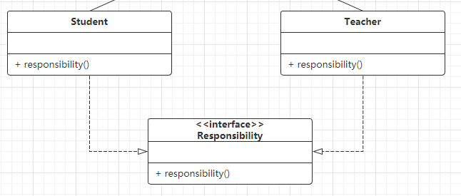
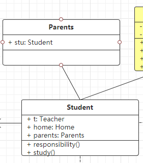
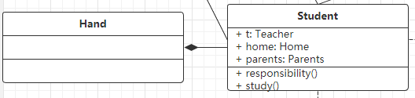

# UML 统一建模语言

## 1.1 类图

### 1.1.1 类的表示

* 比如定义一个Person类

* ```java
  public class Person {
     private String name;
     private int age = 1 ;
  
     public String getName() {
        return name;
     }
     public int getAge() {
        return age;
     }
     public void setName(String name) {
        this.name=name;
     }
     public void setAge(int age) {
        this.age=age;
     }
      
  }
  ```

* 

* 第一格为类名

  * 如果是抽象类用斜体

* 第二格为类的属性

* ```
  权限 属性名: 类型 [ = 默认值 ]	// []为可选项
  ```

* 第三格式为类的方法

* ```
  权限 方法名称(参数列表) [ : 返回类型 ]	// []为可选项
  ```

### 1.1.2 权限表示

| 权限      | 对应符号 | 备注                     |
| --------- | -------- | ------------------------ |
| public    | `+`      | 公有的( 开放权限 )       |
| private   | `-`      | 私有的( 同一个类 )       |
| protected | `#`      | 受保护的( 不同包的子类 ) |
| default   | `~`      | 默认( 同一个包 )         |

## 1.2 类之间的关系

### 1.2.1 泛化关系 (Java继承关系)

* 在UML中 用**空心三角形实线**来表示, 由子类指向父类
* 比如Student类和teacher类 均继承自Person类
* 

### 1.2.2 实现关系(Java类与接口的实现关系)

* 在UML中 用**带空心三角形的虚线**表示, 由类指向接口

* 比如Student的职责是study, 而老师的的职责是teach, 所以我们定义一个接口

* ```java
  public interface Responsibility {
      void responsibility();
  }
  ```

* 

* 实现这个接口

* 

### 1.2.3 依赖关系 (弱)

* 一般指一个类使用另一个类 , 如学生上课, 上完课放学后他们就没有关系了, 如学生类中加入上课方法, 老师类中加入教学方法, 当调用学生的上课方法时, 就调用老师的教学方法

* ```java
  public class Student {
      ...
      public Teacher t ;
      ...
      public void study(){
          t.teach();
      }
  }
  ```

* 这里Student类中引用了Teacher类, 也就是说Student依赖了Teacher, 

* 这种依赖关系用**带箭头的虚线**表示, 箭头指向被依赖的对象

* 

### 1.2.4 关联关系 (强)

* 这种关系比较持久稳定, 如学生和家是一种关联关系(单向关联)
* 关联关系分单项关联和双向关联

#### 单项关联

* 用**带箭头的实线**表示, 箭头指向被应用或者被包含的类
* 比如每个学生都有家, 但是不是每个家里都有学生
* 

#### 双向关联

* 用**不带箭头的实线**表示 (也可以用双向箭头的实线)
* 比如用父母和学生的关系表示双向关联
* 

### 1.2.5 聚合关系

* 用**带空心菱形的直线**表示, 菱形指向整体

* 聚合关系强调的是整体和部分的关系, 其中部分可以脱离整体而存在, 比如狮群和一只狮子的关系, 就是聚合关系, 雄狮离开狮群还是可以独立存在. 
* 比如例子中老师和粉笔的关系
* 

### 1.2.6 组合关系

* 用带实心的菱形直线表示, 菱形指向整体
* 组合关系是一种特殊的关联关系, 又和聚合关系很像, 比如手是学生的一部分, 手不能脱离学生而单独存在
* 

* 各关系的强弱顺序: 
  * **泛化 = 实现 > 组合 > 聚合 > 关联 > 依赖**

就这样完成了一个完整的类图


 再贴一个简单的销售computer的UML类图


## 1.2 时序图

* 时序图 也称为 顺序图, 他通过描述对象之间发送消息的时间顺序显示多个对象之间的动态协作 ( 时序图是一个二维图, 横轴表示对象, 纵轴表示时间 )

### 1.2.1 组成元素

#### 角色

* 系统角色, 可以是人, 机器, 其他系统, 子系统, 在时序图中用 表示

#### 对象

* 比如

#### 生命线

* 表示对象存在的时间 : 

#### 控制焦点( 激活 )

* 又称为激活(期), 表示时间段的符号, 表示这段时间内对象将执行相应的操作

#### 消息

* 同步消息:
  * 消息的发送者把控制传递给消息的接收者，然后停止活动，等待消息的接收者放弃或者返回控制。用来表示同步的意义
* 异步消息:
  * 消息发送者通过消息把信号传递给消息的接收者，然后继续自己的活动，不等待接受者返回消息或者控制。异步消息的接收者和发送者是并发工作的
* 返回消息:
  * 表示从过程调用返回
* 自关联消息:
  * 表示方法的自身调用或者一个对象内的一个方法调用另外一个方法

### 1.2.2 组合片段

* 组合片段用来解决交互执行的条件和方式, 它允许在序列图中直接表示逻辑组件，用于通过指定条件或子进程的应用区域，为任何生命线的任何部分定义特殊条件和子进程

#### 抉择 Alt


***

### 待更

